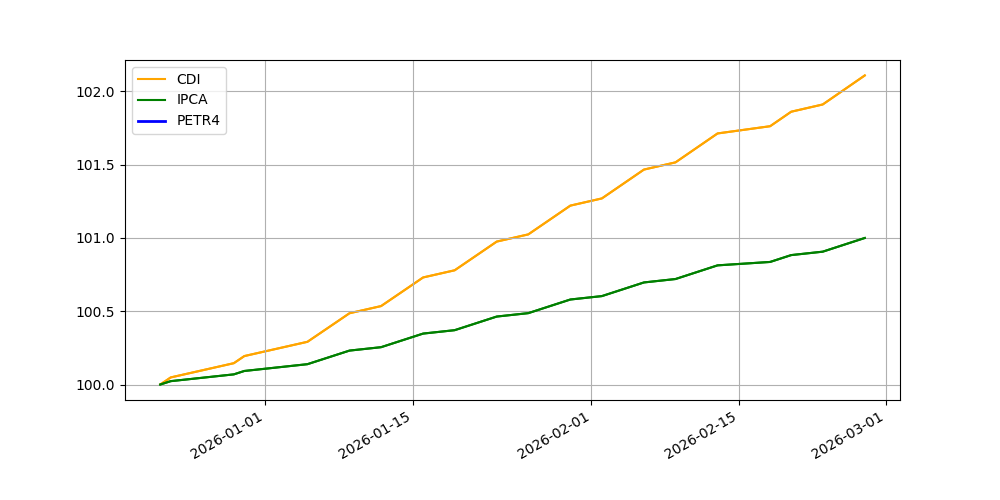

# 📉 Análise Quantitativa e Comparativa de Ativos Financeiros

Este projeto utiliza Python para realizar uma análise de performance de ativos, comparando papéis de renda variável (ex: PETR4) com indicadores de referência do mercado brasileiro (Benchmarks), como o **CDI** e o **IPCA**.

### 🎯 Objetivos da Análise
* **Cálculo de Retorno Real:** Avaliar o ganho dos ativos descontando a inflação (IPCA).
* **Volatilidade e Risco:** Analisar a variação de preços para entender o perfil de risco da alocação.
* **Comparação com CDI:** Validar se a estratégia de investimento superou o custo de oportunidade livre de risco.

### 🛠 Tecnologias Utilizadas
* **Python:** Para processamento e automação dos cálculos.
* **Pandas:** Manipulação de séries temporais financeiras.
* **YFinance:** Extração de dados históricos diretamente da B3/Yahoo Finance.
* **Matplotlib/Seaborn:** Visualização de curvas de patrimônio e correlações.

### 📊 Metodologia Analítica
1. **Coleta:** Importação automatizada de cotações históricas.
2. **Normalização:** Ajuste de bases para comparação direta (Base 100).
3. **Visualização:** Gráficos de linha para acompanhamento da rentabilidade acumulada.
   
### 📊 Análise Visual
   

### 📝 Resultados Obtidos

* **Custo de Oportunidade:** A análise via Base 100 revelou que o CDI foi o benchmark dominante no período, superando significativamente o ativo analisado. Isso evidencia a atratividade da renda fixa frente ao risco da renda variável no intervalo estudado.
* **Manutenção do Poder de Compra:** Observou-se uma correlação próxima entre o Ativo e o IPCA. Embora o ativo não tenha gerado um "Alfa" (ganho acima do benchmark), ele atuou como um hedge inflacionário, preservando o valor real do capital.
